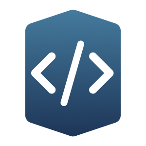

<p align="center">
  
</p>

# Baseplate

 

Baseplate is a platform designed to accelerate the development of coding projects. It automatically generates the necessary code for your features, allowing you to customize the codebase to your specific needs. This way, you can focus more on the harder challenges of coding instead of basic tasks like setting up CRUD (Create, Read, Update, and Delete) APIs or configuration variables.

## Features

Currently, Baseplate focuses on backend and administrative UIs, capable of generating:

- **Node.JS Backend:** This includes a server with CRUD endpoints backed by GraphQL, Prisma, and a Postgres database.

- **Web App:** This is a boilerplate React app compiled with Vite that includes authentication capabilities and communicates with backend APIs.

- **Admin App:** This is a React app that features an admin layout and simple CRUD operations, like viewing a list of users.

## Installation

```bash
git clone https://github.com/halfdomelabs/baseplate.git
cd baseplate
pnpm install
pnpm build
```

## Usage

To start using Baseplate, run the following command in your terminal:

```bash
pnpm serve
```

The server will start on localhost:3230 (or your chosen port).

## Usage by other developers

For information on using Baseplate with an external project, please check our [Introduction to Baseplate Notion](https://www.notion.so/hdlabs/Introduction-to-Baseplate-60881365bb564d308ba144a8352c6efc).

## Support

For support, please open an [issue](https://github.com/halfdomelabs/baseplate/issues) or contact our team at support@halfdomelabs.com.

## Authors

Baseplate is made possible by these great [contributors](https://github.com/halfdomelabs/baseplate/graphs/contributors).

---

Let's build great things together with Baseplate! Happy Coding! 🚀
