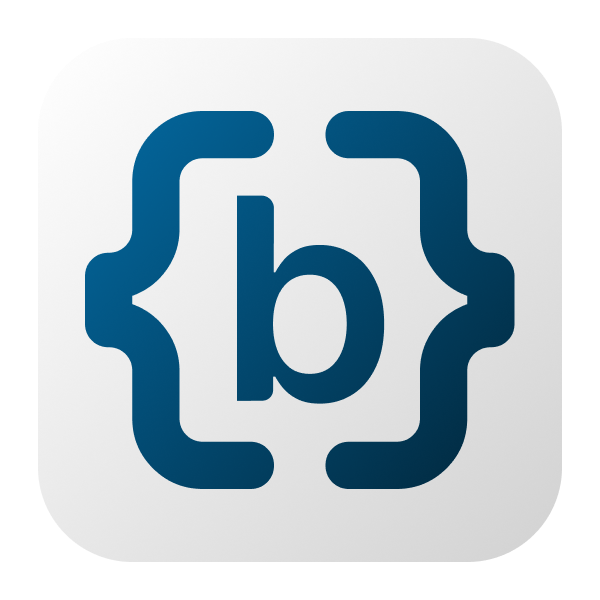

<p align="center">
  
</p>

# Baseplate

 

> **⚠️ WARNING: DEVELOPMENT VERSION**
>
> **This project is still very much in development and not ready for production use.** The code and configuration may introduce breaking changes at any time. While you're welcome to preview Baseplate and provide feedback, please **DO NOT use this in production applications** until we reach our alpha release.
> Use at your own risk for experimentation and development purposes only.

Baseplate is a platform designed to accelerate the development of coding projects. It automatically generates the necessary code for your features, allowing you to customize the codebase to your specific needs. This way, you can focus more on the harder challenges of coding instead of basic tasks like setting up CRUD (Create, Read, Update, and Delete) APIs or configuration variables.

For comprehensive information, visit the official site: [https://www.baseplate.dev/](https://www.baseplate.dev/), or dive into the documentation: [https://docs.baseplate.dev/getting-started](https://docs.baseplate.dev/getting-started).

## Features

Currently, Baseplate focuses on backend and administrative UIs, capable of generating:

- **Node.js Backend:** A server with CRUD endpoints backed by GraphQL, Prisma, and a PostgreSQL database.
- **Web App:** A boilerplate React app compiled with Vite that includes authentication capabilities and communicates with backend APIs.
- **Admin App:** A React app featuring an admin layout and simple CRUD operations, such as viewing a list of users.

## Quickstart

Follow these steps to create and run a new Baseplate project:

1. **Create a new project**
   Run the following command to scaffold a Baseplate project in a directory named `my-app`. Directory names must use lowercase letters, numbers, and dashes.

   ```bash
   pnpm dlx @baseplate-dev/create-project my-app
   ```

   If you omit `my-app`, the project will be created in the current directory.

2. **Start the Baseplate project builder**
   In a terminal window:

   ```bash
   cd my-app
   pnpm baseplate serve
   ```

   The builder's web UI and backend server will start (default port: `4400`). You can now open the web interface in your browser to configure and synchronize your project.

## Development

If you want to work on Baseplate itself (the generator platform), clone and build the repository:

```bash
git clone https://github.com/halfdomelabs/baseplate.git
cd baseplate
pnpm install
pnpm build
```

Once installed, you can start the builder locally:

```bash
pnpm dev:serve
```

The server will run on `localhost:4400` (or the port you specify).

### Parallel Development Environments

You can run multiple Baseplate instances simultaneously using the PORT_OFFSET environment variable:

```bash
# Set up instance 1 (ports: 4301, 4401, 4501)
./scripts/setup-parallel.sh 1

# Set up instance 2 (ports: 4302, 4402, 4502)
./scripts/setup-parallel.sh 2
```

Or manually create a `.env` file in the repository root:

```env
PORT_OFFSET=1  # Adds offset to all ports
```

This is useful for:

- Testing different features in parallel
- Running multiple versions for comparison

## Support

If you encounter any issues or have questions, please:

- Open an [issue](https://github.com/halfdomelabs/baseplate/issues) on GitHub.
- Contact our team at [support@halfdomelabs.com](mailto:support@halfdomelabs.com).

## Authors

Baseplate is made possible by these great [contributors](https://github.com/halfdomelabs/baseplate/graphs/contributors).

## License

Baseplate is licensed under the [Mozilla Public License 2.0 (MPL-2.0)](LICENSE).

## Generated Code Ownership

**All code generated by Baseplate belongs entirely to you** with no restrictions or licensing requirements. You have complete freedom to:

- ✅ Use generated code commercially or non-commercially
- ✅ Modify generated code in any way
- ✅ Distribute generated code under any license (including proprietary)
- ✅ Keep generated code private
- ✅ Sell products built with generated code

Half Dome Labs disclaims any copyright interest in code generated by Baseplate. The generated code has no attribution requirements or licensing restrictions from Baseplate.

---

Let's build great things together with Baseplate! Happy Coding! 🚀
